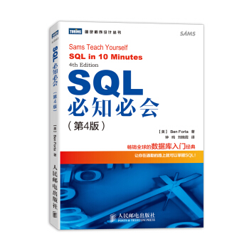

# SQL 必知必会（4th）练习

根据本书，练习使用 SQL 脚本。

Sams Teach Yourself SQL In 10 Minutes 4th Edition &nbsp;(中文名： sql 必知必会（4th）)

https://item.jd.com/11232698.html



## 内容

查看 [Tutorials](./tutorials)。

```
./tutorials
├── 001.create.sql
├── 001.populate.sql
├── 002.select-from.sql
├── 003.oder-by.sql
├── 004.where.sql
├── 005.where_and_or_not_in.sql
├── 006.like.sql
├── 007.concatenate_and_select-as.sql
├── 008.function.sql
├── 009.max_min_avg.sql
├── 010.group-by.sql
├── 011.subquery.sql
├── 012.join.sql
├── 013.advance_join.sql
├── 014.union.sql
├── 015.insert.sql
├── 016.update_del.sql
├── 017.cre_mv_del_table.sql
├── 018.view.sql
└── 019.procudure.sql
```

## 安装 MySQL

本教程使用 Docker Compose 运行 MySQL 服务。

### 配置

环境变量，MySQL 运行端口、ROOT 密码等。

```
cp sample.env .env
```

启动服务。

```
./scripts/start.sh
```

查看服务状态。

```
docker-compose ps
```

连接 MySQL，使用工具 MySQL Workbench，Navicat 等。

### 停止服务

```
docker-compose down
```

### 停止并清空数据

```
./scripts/flush.sh
```

## 开源许可协议

Copyright 2019 Hai Liang Wang <hailiang.hl.wang@gmail.com>

Licensed under the Apache License, Version 2.0 (the "License");
you may not use this file except in compliance with the License.
You may obtain a copy of the License at

    http://www.apache.org/licenses/LICENSE-2.0

Unless required by applicable law or agreed to in writing, software
distributed under the License is distributed on an "AS IS" BASIS,
WITHOUT WARRANTIES OR CONDITIONS OF ANY KIND, either express or implied.
See the License for the specific language governing permissions and
limitations under the License.
